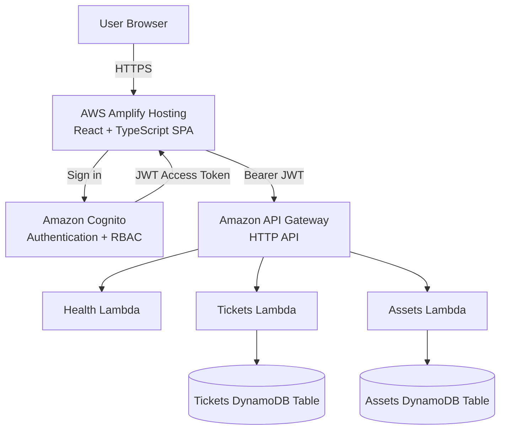

# Nubora

### Secure Cloud-Native IT Operations Platform

Nubora is a full-stack cloud application for managing IT support tickets and organizational hardware assets.

The project was designed as a practical cloud engineering, software engineering, and cybersecurity portfolio project. It combines a React frontend with a serverless AWS backend, secure authentication, role-based access control, persistent cloud storage, operational analytics, and automated deployment.

## Live Application

Nubora is deployed using AWS Amplify Hosting:

https://main.d34b9fsygbqf43.amplifyapp.com

> Authentication is required to access the operational dashboard.

---

## Features

### IT Support Ticket Management

Nubora provides complete ticket management capabilities:

- Create support tickets
- View all tickets
- Edit ticket details
- Update ticket status
- Assign tickets to technicians
- Set ticket priority
- Delete tickets
- Search tickets
- Filter by status
- Filter by priority
- Persistent storage using Amazon DynamoDB

### Asset Management

Nubora includes an organizational hardware inventory system:

- Add managed assets
- View all assets
- Edit asset information
- Track asset status
- Assign assets to users or departments
- Delete assets
- Search by:
  - Asset name
  - Asset ID
  - Serial number
  - Manufacturer
  - Model
  - Assignee
  - Department
- Filter by:
  - Asset type
  - Status
  - Department

### Operational Dashboard

The Overview dashboard provides real-time operational information from AWS resources, including:

- Total tickets
- Active tickets
- Managed assets
- API health
- Ticket status breakdown
- Ticket priority breakdown
- Asset status summary
- Assets by department
- Recently updated tickets

---

## Role-Based Access Control

Nubora uses Amazon Cognito groups and JWT claims to enforce role-based access control.

| Capability | Admins | Technicians | Viewers |
|---|:---:|:---:|:---:|
| View dashboard | ✅ | ✅ | ✅ |
| View tickets | ✅ | ✅ | ✅ |
| Search/filter tickets | ✅ | ✅ | ✅ |
| Create tickets | ✅ | ✅ | ❌ |
| Edit tickets | ✅ | ✅ | ❌ |
| Delete tickets | ✅ | ❌ | ❌ |
| View assets | ✅ | ✅ | ✅ |
| Search/filter assets | ✅ | ✅ | ✅ |
| Create assets | ✅ | ✅ | ❌ |
| Edit assets | ✅ | ✅ | ❌ |
| Delete assets | ✅ | ❌ | ❌ |

Authorization is enforced by the backend in addition to hiding unauthorized controls in the frontend.

---

## Architecture



### Request Flow

```text
User
  │
  │ HTTPS
  ▼
AWS Amplify Hosting
  │
  │ React / TypeScript
  ▼
Amazon Cognito
  │
  │ JWT
  ▼
Amazon API Gateway
  │
  ├──────────────┬──────────────┐
  ▼              ▼              ▼
Health Lambda  Tickets Lambda  Assets Lambda
                  │              │
                  ▼              ▼
              DynamoDB       DynamoDB
```

---

## AWS Services

Nubora currently uses the following AWS services:

### AWS Amplify Hosting

Hosts the production React application and automatically deploys changes from the GitHub `main` branch.

### Amazon Cognito

Provides:

- User authentication
- Secure login sessions
- JWT access tokens
- User groups
- Role-based authorization

Configured application roles:

```text
Admins
Technicians
Viewers
```

### Amazon API Gateway

Provides the public HTTP API used by the React application.

Protected API routes require a valid Cognito JWT.

### AWS Lambda

Serverless Python functions handle application logic for:

```text
Health
Tickets
Assets
```

### Amazon DynamoDB

Provides persistent NoSQL storage for:

```text
nubora-dev-tickets
nubora-dev-assets
```

---

## API

### Health

```http
GET /health
```

Public health-check endpoint.

### Tickets

```http
GET    /tickets
GET    /tickets/{ticketId}
POST   /tickets
PUT    /tickets/{ticketId}
DELETE /tickets/{ticketId}
```

### Assets

```http
GET    /assets
GET    /assets/{assetId}
POST   /assets
PUT    /assets/{assetId}
DELETE /assets/{assetId}
```

Ticket and asset routes are protected using Cognito JWT authorization.

---

## Security

Security was treated as a core part of the project rather than an additional feature.

### Authentication

Users authenticate using Amazon Cognito.

Passwords and authentication tokens are not stored in the application repository.

### JWT Authorization

Protected API requests include:

```http
Authorization: Bearer <access-token>
```

API Gateway validates the Cognito token before allowing access to protected routes.

### Role-Based Authorization

Lambda functions inspect Cognito group claims to determine whether a user is authorized to perform an operation.

This prevents users from bypassing frontend restrictions by directly calling the API.

### Least Privilege

Individual Lambda execution roles are granted access only to the DynamoDB resources required by the function.

### CORS

API Gateway CORS is configured only for approved development and production origins.

### Environment Configuration

Frontend environment variables contain resource identifiers and endpoints only.

Sensitive credentials such as the following are never committed:

```text
AWS access keys
AWS secret keys
User passwords
JWT access tokens
```

---

## Technology Stack

### Frontend

- React
- TypeScript
- Vite
- React Router
- AWS Amplify client libraries
- CSS

### Backend

- Python
- AWS Lambda
- Amazon API Gateway

### Data

- Amazon DynamoDB

### Authentication & Security

- Amazon Cognito
- JWT
- Role-Based Access Control
- IAM

### DevOps / Cloud

- AWS Amplify Hosting
- GitHub
- Git
- AWS CLI
- PowerShell

---

## Project Structure

```text
nubora/
│
├── .github/
│   └── workflows/
│
├── backend/
│   └── functions/
│       ├── health/
│       │   └── lambda_function.py
│       │
│       ├── tickets/
│       │   └── lambda_function.py
│       │
│       └── assets/
│           └── lambda_function.py
│
├── docs/
│
├── frontend/
│   ├── public/
│   │
│   ├── src/
│   │   ├── components/
│   │   │   └── AppLayout.tsx
│   │   │
│   │   ├── config/
│   │   │   └── amplify.ts
│   │   │
│   │   ├── pages/
│   │   │   ├── Assets.tsx
│   │   │   ├── Dashboard.tsx
│   │   │   ├── Login.tsx
│   │   │   └── Tickets.tsx
│   │   │
│   │   ├── services/
│   │   │   ├── api.ts
│   │   │   └── auth.ts
│   │   │
│   │   ├── App.tsx
│   │   ├── index.css
│   │   └── main.tsx
│   │
│   ├── .env.example
│   ├── package.json
│   └── package-lock.json
│
├── infrastructure/
│
├── scripts/
│   └── dev-session.ps1
│
├── amplify.yml
├── .gitignore
├── LICENSE
├── README.md
└── SECURITY.md
```

---

## Local Development

### Requirements

Install:

- Node.js
- npm
- Python
- AWS CLI
- Git

Clone the repository:

```bash
git clone https://github.com/argenisy28/nubora.git
cd nubora
```

Install frontend dependencies:

```bash
cd frontend
npm install
```

Create:

```text
frontend/.env.local
```

using:

```text
frontend/.env.example
```

Required variables:

```env
VITE_AWS_REGION=
VITE_API_ENDPOINT=
VITE_COGNITO_USER_POOL_ID=
VITE_COGNITO_CLIENT_ID=
```

Start the development server:

```bash
npm run dev
```

The development application runs on:

```text
http://localhost:5173
```

---

## Production Deployment

Nubora uses AWS Amplify continuous deployment.

The production pipeline is:

```text
GitHub
   │
   │ push to main
   ▼
AWS Amplify
   │
   ├── npm ci
   ├── npm run build
   │
   ▼
Vite dist/
   │
   ▼
AWS Amplify Hosting
```

Changes pushed to the `main` branch can automatically trigger a new production deployment.

---

## Development Milestones

### Phase 1 — Project Foundation

- Repository structure
- Git workflow
- Initial documentation

### Phase 2 — AWS Backend

- DynamoDB tables
- Lambda functions
- IAM roles
- API Gateway

### Phase 3 — Ticket API

- Ticket CRUD
- API testing
- DynamoDB persistence

### Phase 4 — Asset API

- Asset CRUD
- API testing
- DynamoDB persistence

### Phase 5 — Authentication & Security

- Cognito user pool
- Cognito app client
- JWT authorization
- Admin, Technician, and Viewer roles
- Backend RBAC

### Phase 6 — React Application

- Authentication UI
- Operations dashboard
- Ticket management
- Asset management
- Search and filtering
- Role-aware controls

### Phase 7 — Analytics

- Ticket status analytics
- Ticket priority analytics
- Asset health
- Department inventory
- Recent activity

### Phase 8 — Production Deployment

- AWS Amplify Hosting
- Production HTTPS
- Production CORS
- SPA routing
- Live AWS integration

---

## Roadmap

Potential future improvements include:

- Audit logging and activity history
- CloudWatch operational monitoring
- Ticket comments
- User management
- Ticket categories
- SLA tracking
- Email notifications
- Advanced analytics
- Infrastructure as Code
- Automated testing
- CI/CD security checks
- AI-assisted ticket classification
- AI-assisted incident prioritization
- Security event integration

---

## Skills Demonstrated

Nubora demonstrates practical experience with:

- Full-stack software development
- Cloud-native application architecture
- REST API development
- Serverless computing
- NoSQL database design
- Authentication
- JWT authorization
- Role-based access control
- IAM permissions
- React application architecture
- TypeScript
- Python
- AWS CLI
- Git/GitHub workflows
- Production deployment
- Cloud security concepts

---

## Author

**Argenis Vélez Alvarez**

Computer Engineering Student

Areas of interest:

- Cybersecurity
- Cloud Engineering
- Software Engineering
- IT Infrastructure

GitHub: [argenisy28](https://github.com/argenisy28)